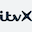

## 👋 Hi, I'm Nat Ritmeyer

#### What I do

- 💁‍♂️ **Software Quality Architect**
- 💡 Clean Code | XP | TDD | BDD
- 🚄 CI/CD pipelines | DevOps
- 💼 Test Strategy | QA Governance
- 🧑‍🤝‍🧑 Hiring | Developer and SDET mentorship
- 💻 Open-source test automation software author

#### Some previous clients

-                 

#### Links

- 🌐 [Website](https://natritmeyer.com/) (I should update this more often)
- 👔 [LinkedIn](https://www.linkedin.com/in/nathanielritmeyer/) (endorse me for the `Dinosaurs` skill !)
- 🙋‍♂️ [StackOverflow](https://stackoverflow.com/users/2032500/nat-ritmeyer/) (feeding the LLMs)

#### Skills

- 🗒️ Tinkering with dotfiles
- 👨‍💻 Escaping vim
- 🙈 `$ git reset HEAD~`

#### Other

- 🌍 Nationalities: 🇮🇪 (🇪🇺), 🇬🇧
- 🔐 [Public key](https://github.com/natritmeyer.gpg) (🫆 `2BC1 D6BA B6B0 C4AF 07D1  13AC 7BA4 2679 EC0F D719`)
- 🎤 [Quotes](./QUOTES.md) - Software development wisdom
- 📚 [Recommended resources](./RECOMMENDED_RESOURCES.md) - Great books and videos
